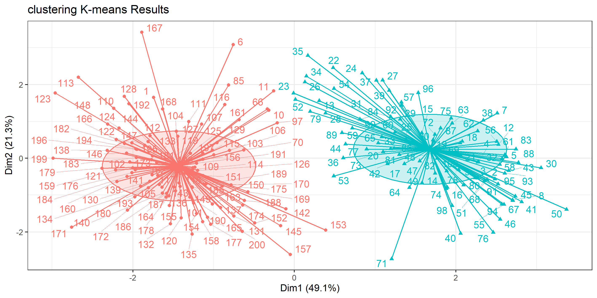
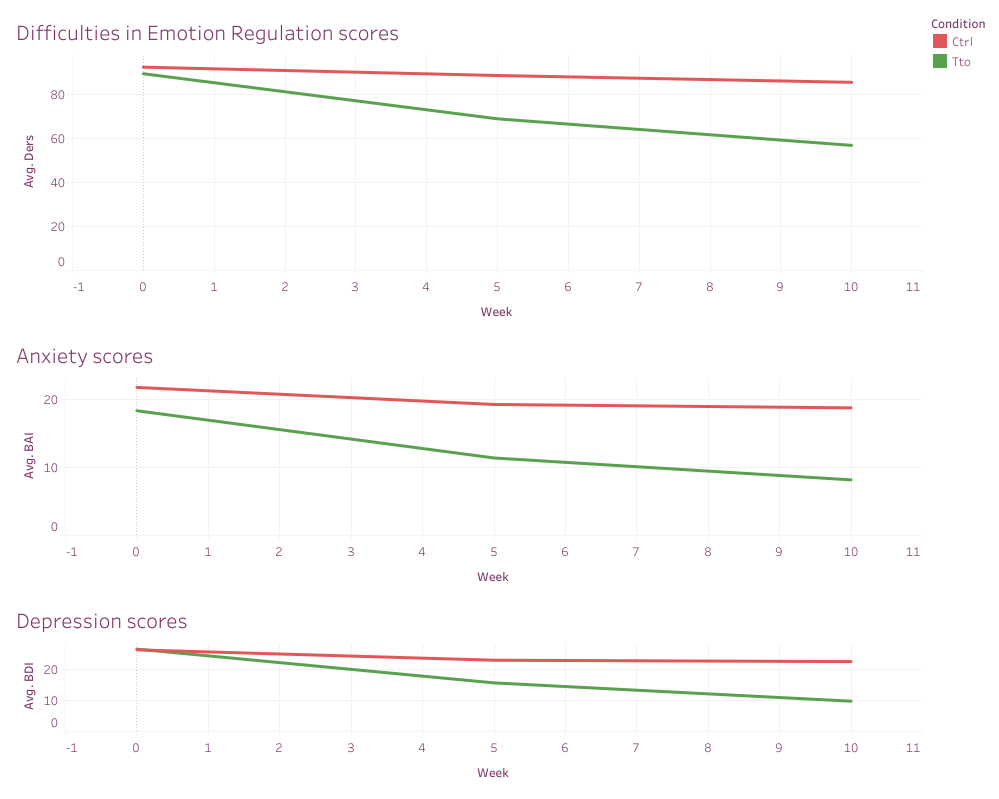
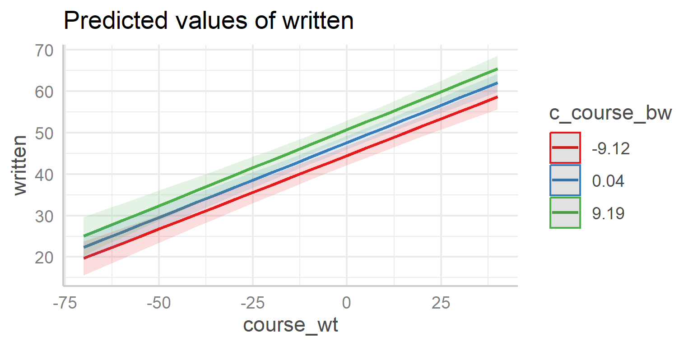
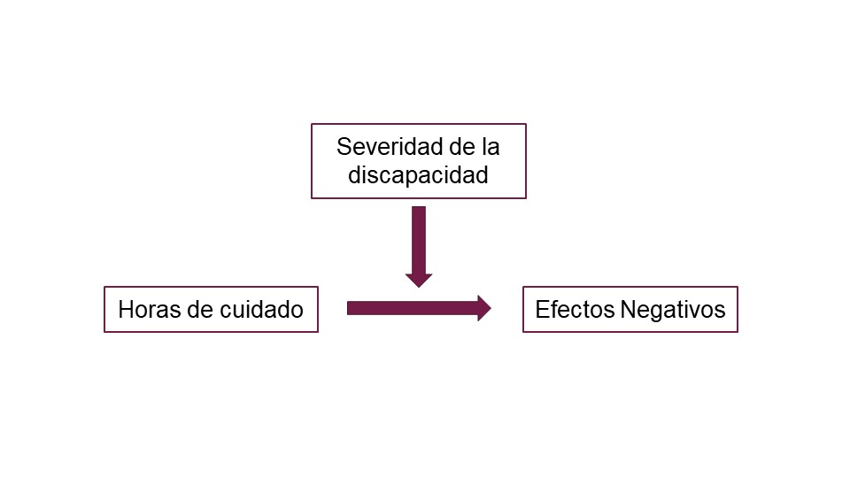
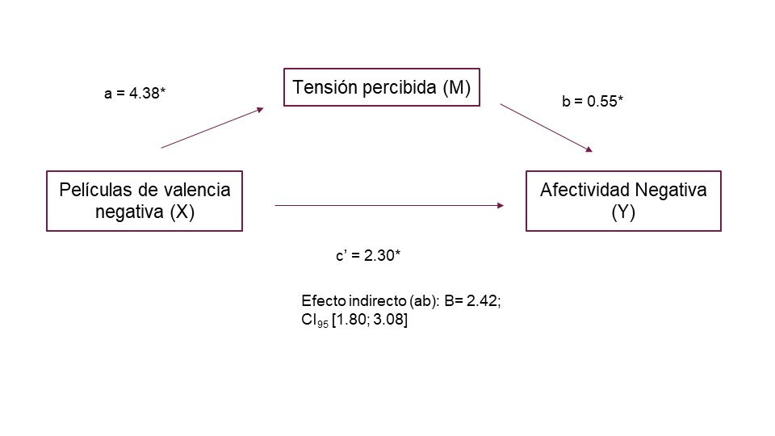
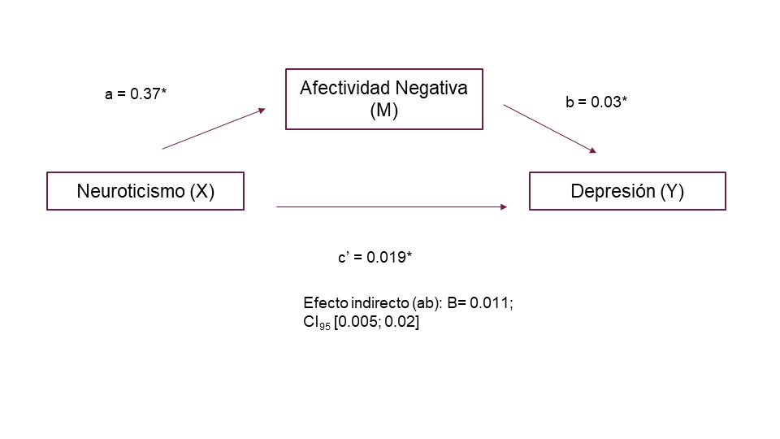

# Camila Cremades' Portfolio

## About me

I am a data enthusiast with a strong background in psychology and data analytics. I hold a Bachelor's in Psychology, a Master's in Psychological Evaluation, and a specialization in Data Analytics for Social Sciences. I teach statistics at the University of Buenos Aires' Psychology Department and contribute to a research team studying the efficacy of psychological interventions. Throughout my research career, I’ve often been the go-to person for data analysis, which has fueled my passion for transforming raw data into actionable insights.

I am currently a forum moderator for the Google Data Analytics courses on Coursera, where I assist students in their analytics journey. I am eager to join a team of experienced professionals to continue learning and expanding my expertise in data analytics.

Beyond work, I enjoy acroyoga, contemporary dance, and playing board games with friends. For me, answering questions through data feels like solving a captivating board game mystery, unraveling clues and discovering meaningful solutions.

## Case Studies

### [Cluster analysis to determine bill authenticity](https://camila-cremades.github.io/Case-Studies/Cluster_Analysis.html)

**Project Objective** 
To determine whether a clustering method based on physical measurements can effectively detect authenticity of Swiss 1000-franc bills (genuine vs. counterfeit).

**Data Used** 
The banknote dataset from R package mclust containing:
- 200 observations (100 genuine, 100 counterfeit)
- Six physical measurements: Length, Left margin width, Right margin width, Bottom margin width, Top margin width, and Diagonal length (all in mm)
- Status variable indicating authenticity (genuine/counterfeit)

**Statistical Procedure**
1. Data preparation: Created standardized dataset (Bills_Std) excluding the status variable
2. Cluster tendency assessment: Hopkins statistic (0.26) indicated potential for clustering
3. Optimal cluster determination using multiple methods:
- Elbow, Silhouette, and GAP methods all suggested 2 clusters
- Hierarchical clustering dendrogram confirmed 2 distinct groups
4. K-means clustering with k=2 applied to the standardized dataset
5. Comparison of cluster assignments with actual bill status

**Key Findings**
- Clustering analysis successfully identified two distinct groups corresponding to genuine and counterfeit bills
- Classification accuracy:
  - 100% of counterfeit bills correctly classified
  - 92% of genuine bills correctly classified
  - 96% overall classification accuracy
- Principal Component Analysis (PCA) visualization showed clear separation between genuine bills (right side) and counterfeit bills (left side)
- The study concludes that physical measurements (dimensions and margins) of bills are highly effective for determining bill authenticity

### [Efficacy of the Unified Protocol for Emotional Disorders](https://camila-cremades.github.io/Case-Studies/Mix_Lineal_Reg_PU_Eficacy.html)

**Project Objective** 
To evaluate the efficacy of the Unified Protocol, a transdiagnostic intervention for emotional disorders, by comparing treatment and control (waitlist) groups across multiple outcome measures.

**Method** 
Study design: Randomized controlled trial 
Sample: 46 participants randomized to treatment or waitlist control 
Assessment points: Baseline (week 0), mid-treatment (week 5), and post-treatment (week 10) 
Outcome measures:
- Emotional Dysregulation (DERS): 30-item scale
- Depression (BDI): 21-item scale
- Anxiety (BAI): 21-item scale

**Statistical Procedure** 
Mixed-effects linear modeling with:
- Fixed effects: Time (weeks), condition (treatment vs. control), and their interaction
- Random effects: Participant ID and questionnaire items
- Model comparison between base models (random effects only) and full models (with fixed effects)
- End-of-treatment group comparisons using adjusted marginal means (emmeans)

**Key Findings** 
Emotional Dysregulation (DERS):
- Significant interaction between time and treatment condition (b = -0.08, p < .001)
- At week 10, treatment group showed significantly lower emotional dysregulation (difference = 0.98, p < .001)

Depression (BDI):
- Significant interaction between time and treatment condition (b = -0.06, p < .001)
- At week 10, treatment group showed significantly lower depression (difference = 0.57, p < .001)

Anxiety (BAI):
- Significant interaction between time and treatment condition (b = -0.03, p < .001)
- At week 10, treatment group showed significantly lower anxiety (difference = 0.52, p < .001)

Overall, the Unified Protocol demonstrated significant efficacy in reducing emotional dysregulation, depression, and anxiety symptoms compared to waitlist control, with improvements becoming more pronounced over the course of treatment.

### [Evaluation of the Effects of Practices and School Type on Exam Scores](https://camila-cremades.github.io/Case-Studies/Lineal_Regresion_2.html)

**Objective** 
The study aimed to evaluate the effects of course performance ("exercise in the course") on written exam scores, analyzing both within-school and between-school variations.

**Data** 
The analysis used the GCSE exam scores dataset from the mlmRev package, containing variables for schools, students, gender, written exam scores, and course performance metrics.

**Statistical Procedure** 
Hybrid Random Effects Models (HREM) were employed to separate and analyze both within-school and between-school effects:
- Unconditional Model: Established baseline variation in written exam scores
- Fixed Effects Model: Examined effects of within-school (course_wt) and between-school (c_course_bw) course performance
- Random Effects Model: Added random slopes for within-school course performance
- Interaction Model: Tested cross-level interactions between within-school and between-school effects
- Models were compared using likelihood ratio tests and evaluated using AIC/BIC criteria.

**Key Findings** 
- Baseline Performance: The average written exam score across all schools was 47.6 points, with significant between-school variation (ICC = 0.28)
- Within-School Effects: Students who scored higher than their school's average in coursework showed significantly better written exam performance (β = 0.36, p < .001)
- Between-School Effects: Schools with higher average coursework scores produced students with significantly better written exam scores (β = 0.34, p < .001)
- Random Effects: The relationship between coursework and exam scores varied significantly across schools, with the random slope model showing better fit than fixed effects alone (χ²(2) = 27.94, p < .001)
- Cross-Level Interaction: No significant interaction was found between within-school and between-school course performance (p = .74), indicating that the relationship between individual coursework and exam performance remained consistent regardless of school-level averages

The findings demonstrate that course performance significantly impacts written exam scores at both individual and institutional levels, highlighting the importance of coursework quality across educational contexts.

### [Mediation and moderation of psychological variables](https://camila-cremades.github.io/Case-Studies/Mediation_Moderation.html)

**Objective** 
The project investigated three main relationships:
1. Whether disability severity moderates the effect of caregiving hours on negative affect
2. Whether perceived tension mediates the effect of negative-affect-oriented movies on negative affect
3. Whether negative affect mediates the relationship between neuroticism and depression

**Data Sources** 
Activity 1: efc dataset from sjPlot package 
Activities 2 & 3: affect dataset from psychTools package

**Statistical Procedures** 
Activity 1: Moderation analysis using regression with interaction terms 
Activity 2: Mediation analysis using MBESS package with bootstrapping (10,000 iterations) 
Activity 3: Mediation analysis using mediation package with bootstrapping (10,000 iterations) 

**Key Findings** 
Activity 1: Moderation Effect
- Disability severity significantly moderated the relationship between caregiving hours and negative affect (B = 0.0002, p < .01)
- As disability severity increased, the effect of caregiving hours on negative affect also increased
- The main effect of disability severity was significant (B = -0.05, p < .001)

Activity 2: Mediation Analysis (Movies → Tension → Negative Affect)
- Total effect (c): Negative-affect movies significantly increased negative affect (B = 4.73, p < .001)
- Path a: Negative-affect movies significantly increased perceived tension (B = 4.38, p < .001)
- Path b: Perceived tension significantly predicted negative affect (B = 0.55, p < .001)
- Direct effect (c'): Effect decreased when controlling for tension (B = 2.30, p < .001)
- Significant indirect effect through perceived tension (B = 2.42, 95% CI [1.80, 3.08])

Activity 3: Mediation Analysis (Neuroticism → Negative Affect → Depression)
- Total effect (c): Neuroticism significantly predicted depression (B = 0.03, p < .001)
- Path a: Neuroticism significantly predicted negative affect (B = 0.37, p < .001)
- Path b: Negative affect significantly predicted depression (B = 0.03, p < .001)
- Direct effect (c'): Effect decreased when controlling for negative affect (B = 0.019, p < .001)
- Significant indirect effect through negative affect (B = 0.011, 95% CI [0.005, 0.02])

This study demonstrates the importance of considering both mediating and moderating variables when examining psychological relationships, particularly in caregiving contexts and emotional responses.

### [Predictors of Job Satisfaction and Employee Performance](https://camila-cremades.github.io/Case-Studies/PractInvI.html)

**Objective** 
This study aimed to identify key predictors of job satisfaction and employee performance in a sample of 300 employees from a technology solutions company, analyzing relationships between demographic, organizational, and clinical variables.

**Data Used** 
The dataset included 300 employees with variables including:
- Demographic: Gender (female/male)
- Work-related: Job type (4 categories), Home office status, Job satisfaction, Performance
- Psychological: Cognitive flexibility, Work environment perception, Self-esteem, Future job outlook, Anxiety, Depression
- Other: Intelligence, Social network

**Statistical Procedures** 
1. Descriptive statistics and normality testing for all variables
2. Chi-square tests to analyze associations between categorical variables
3. T-tests and ANOVA to compare job satisfaction across groups
4. Pearson correlations to assess relationships between continuous variables
5. Multiple regression analysis using stepwise selection for job satisfaction prediction
6. Logistic regression with ROC curve analysis for employee performance prediction

**Key Findings** 
Group Differences in Job Satisfaction
- Gender: Women reported significantly higher job satisfaction (M = 54.11, SD = 9.95) than men (M = 46.98, SD = 8.92), t(254) = -6.40, p < .001, d = 0.76, representing a moderate effect.
- Home Office: Employees working from home reported significantly higher job satisfaction (M = 54.11, SD = 9.43) than those working in-person (M = 45.42, SD = 8.54), t(298) = -8.37, p < .001, d = 0.97, representing a large effect.
- Job Type: Significant differences were found between job types, F(3, 296) = 3.50, p = .016, η² = .03. Post-hoc Tukey tests revealed that customer service employees had significantly lower job satisfaction compared to marketing employees (p < .05).

Job Satisfaction Predictors 
A multiple regression model explained 92% of variance in job satisfaction (F(6,239) = 525.9, p < .001). Significant predictors included:
- Cognitive flexibility (β = 0.92, p < .001) - positive relationship
- Work environment perception (β = -0.75, p < .001) - negative relationship
- Self-esteem (β = -0.34, p < .001) - negative relationship
- Future job outlook (β = 1.32, p < .001) - positive relationship
- Anxiety (β = -0.58, p < .001) - negative relationship
- Depression (β = 0.67, p < .001) - positive relationship

Employee Performance Predictors 
The logistic regression model showed excellent predictive accuracy (ROC = 0.99), with sensitivity of 97.89% and specificity of 91.14%. Key findings included:
- Work environment perception had the strongest positive impact: a 12-point increase multiplied the odds of satisfactory performance by 5,034 times
- Job satisfaction showed a strong positive effect: a 10-point increase multiplied performance odds by 177.5 times
- Cognitive flexibility showed a negative relationship: a 15-point increase decreased performance odds by 89 times
- Job type was significant: customer service and sales employees had 94 times lower odds of satisfactory performance compared to marketing employees

**Conclusion** 
The analysis revealed that job satisfaction is significantly influenced by work arrangements (home office), gender, and job type. The regression models identified key psychological factors that predict both job satisfaction and performance, with work environment perception emerging as particularly important for performance outcomes. These findings provide valuable insights for developing targeted organizational interventions to enhance employee satisfaction and performance.

### [Regresion Analysis to predict cigarette sales in the USA](https://camila-cremades.github.io/Case-Studies/Lineal_Regresion.html)

**Objective** 
To construct a regression model that relates per-capita cigarette consumption (Sales) across U.S. states to various socioeconomic and demographic variables, and to determine whether these variables are useful predictors of cigarette consumption.

**Data Used** 
The dataset contained information from all 50 U.S. states with the following variables:
- SALES: Per-capita cigarette consumption
- AGE: Percentage of the population aged 16-24
- HS: Percentage with high school education
- INCOME: Per capita personal income
- BLACK: Percentage of African American population
- FEMALE: Percentage of female population
- PRICE: Average price of cigarette packs

**Statistical Procedure**
1. Correlation analysis to examine linear relationships between Sales and potential predictors
2. Multiple linear regression with best subset selection to identify optimal predictors
3. Collinearity testing of predictor variables
4. Residual analysis to evaluate model assumptions (normality, homoscedasticity)
5. Identification and analysis of outliers and influential observations

**Key Findings**
- The best regression model included two significant predictors: INCOME and PRICE
  - INCOME had a positive effect on sales (β = 0.022, p = 0.002)
  - PRICE had a negative effect on sales (β = -3.018, p = 0.004)
- The model explained 25% of the variability in cigarette sales (R² = 0.250)
- The model was statistically significant overall (F = 8.012, p = 0.001)
- No collinearity issues were detected between the predictor variables
- Analysis identified outliers (New Hampshire and Nevada) and an influential observation (Washington DC), but these were retained in the model to maintain generalizability across all U.S. states
- The Breusch-Pagan test indicated heteroscedasticity issues, though these may be attributed to the presence of outliers

The findings suggest that higher income levels increase cigarette consumption while higher prices reduce it, confirming basic economic theory of consumer behavior in this market.

### [Sex prediction from psychological variables using Machine Learning](https://camila-cremades.github.io/Case-Studies/Sex-prediction-from-psychological-variables.html)

For the following study, a database obtained from the Open Code Psychometrics website was used. The questionnaire consists of 163 items organized into a reasoning scale and 15 primary personality scales, each with 10 items.
In this study, an optimal supervised model was developed to maximize its predictive capacity in determining whether personality traits could be considered relevant variables for the psychology of sex differences.

## Published papers

[Celleri, M., Klajner, F., Cremades, F. C., Garay, C. J., Etchevers, M., & Osma, J. (2025). Usability and Acceptance by Therapists and Users of an Internet‐Based Intervention Based on the Unified Protocol in Argentina. Journal of Clinical Psychology. https://doi.org/10.1002/jclp.70037](https://onlinelibrary.wiley.com/doi/10.1002/jclp.70037)

[Rodante, D. E., Bellotti, M., Boscolo, M., Cremades, C., Melone, M., Gagliesi, P., & Mehlum, L. (2024). Safety Planning Intervention Training Among Early Career Mental Health Professionals: Perception of Self-Efficacy, Usefulness and Feasibility. Archives of Suicide Research, 1–15. https://doi.org/10.1080/13811118.2024.2335956](https://www.tandfonline.com/doi/full/10.1080/13811118.2024.2335956)

[Cremades, C., Melone, M., Bellotti, M., Boscolo, M., Rivas, A. L., Neumann, J., Lublinsky, L., & Rodante, D. (2024). Pilot study on the effect of an effective anger management group based on Dialectical Behavior Therapy (DBT). Vertex Revista Argentina De Psiquiatría, 35(165, jul.-sep.), 16–24. https://doi.org/10.53680/vertex.v35i165.656](https://revistavertex.com.ar/ojs/index.php/vertex/article/view/656)

[Natapof, D.G., Celleri, M., Appeceix, A.L., Kaplan, M., Cremades, C., Garay, C.J.(2024). Prevention of Emotional Disorders in University Students: Implementation and Adaptation of IUPI-P, a Program Based on Cognitive-Behavioral Therapy and the Unified Protocol. Anuario de Investigaciones, 30](https://www.psi.uba.ar/publicaciones/anuario/trabajos_completos/30/natapof.pdf)

[Cremades, C., Garay, C. J., Etchevers, M. J., Muiños, R., Peker, G. M., & Gómez Penedo, J. M. (2023). Adaptation and Validation of the Emotional Regulation Difficulty Scale in Adults in the Metropolitan Area of Buenos Aires. Avances En Psicología Latinoamericana , 41(3), 1–18. https://doi.org/10.12804/revistas.urosario.edu.co/apl/a.11523](https://revistas.urosario.edu.co/index.php/apl/article/view/11523)

[Celleri, M., Koutsovitis, F., Cremades, C., y Garay, C. J. (2023). Perceived quality of life index in patients with functional gastrointestinal disorders in Buenos Aires, Argentina. Acta Colombiana de Psicología, 26(1), 45–55. https://doi.org/10.14718/ACP.2023.26.1.4](https://actacolombianapsicologia.ucatolica.edu.co/article/view/3824)

[Celleri, M., Cremades , C. F., Rojas, R. L., Garay , C. J., & Osma, J. J. (2023). Pilot study on the clinical utility and acceptability of the Unified Protocol for the transdiagnostic treatment of emotional disorders in an online and group format in Argentina. Acción Psicológica, 19(2), 63–80. https://doi.org/10.5944/ap.19.2.37004](https://revistas.uned.es/index.php/accionpsicologica/article/view/37004)

[Rojas, R. L., Cremades, C. F., Celleri, M., & Garay, C. J. (2023). Overall Anxiety Severity and Impairment Scale (OASIS) and Overall Depression Severity and Impairment Scale (ODSIS): Adaptation and Validation in Buenos Aires, Argentina. Clinical Psychology in Europe, 5(2), 1-19. https://doi.org/10.32872/cpe.10451](https://cpe.psychopen.eu/index.php/cpe/article/view/10451)

[Celleri, M. & Cremades, C. (2022). Group processes and virtuality: patient experiences in an online intervention based on emotional regulation. In School of Psychology Award University of Buenos Aires 2022. (pp. 11-26). University of Buenos Aires](https://www.psi.uba.ar/premio/2022/calleri.pdf)

[Celleri, M., Cremades, C. F., Rojas, L., & Garay, C. J. (2023). Unified Protocol for the transdiagnostic treatment of emotional disorders in virtual and group format in Argentina: three months follow-up of a pilot study. Vertex Revista Argentina De Psiquiatría, 34(161, jul.-sept.), 18–23. https://doi.org/10.53680/vertex.v34i161.482](https://revistavertex.com.ar/ojs/index.php/vertex/article/view/482)

Cremades, C., Celleri, M., Menendez, A. & Garay, C. J. (2022). Multidimensional Experiential Avoidance Questionnaire (MEAQ): Spanish adaptation and validation in Argentina, Buenos Aires. Manuscript submitted for publication.

[Cremades, C., Garay, C., Etchevers, M., Muiños, R., Peker, G., & Gómez Penedo, J. (2022). Contemporaneous Emotion Regulation Theoretical Models: A Systematic Review. Interacciones, 8, e237. https://doi.org/10.24016/2022.v8.237](https://ojs.revistainteracciones.com/index.php/rin/article/view/237)

[Ortega, I., Donatti, S., Cremades, C. & Garay, C. (2022). Anxiety and depression in patients with functional gastrointestinal disorders in a hospital in the city of Buenos Aires. Revista Psicología de la Salud, 10(1), 69-79. http://doi.org/10.21134/pssa.v10i1.814](https://revistas.innovacionumh.es/index.php/psicologiasalud/article/view/1224)

[Celleri, M., Menendez, A., Cremades, C. & Garay, C. J. (2021). Development of an online intervention for emotional disorders based on the Unified Protocol in Argentina. Intersecciones, 39](http://intersecciones.psi.uba.ar/index.php?option=com_content&view=article&id=860:desarrollo-de-una-intervencion-online-para-trastornos-emocionales-basada-en-el-protocolo-unificado-en-argentina&catid=11:alumnos&Itemid=1)

[Cremades, C., Garay, C., & Etchevers, M. (2021). Treatment of emotional dysregulation in hospitals in the metropolitan area of Buenos Aires: a survey of professionals. Interdisciplinaria. Revista de Psicología y Ciencias Afines, 38(3), 103-116. https://doi.org/10.16888/interd.2021.38.3.6](https://www.ciipme-conicet.gov.ar/ojs/index.php?journal=interdisciplinaria&page=article&op=view&path[]=682)

[Donatti, S., Cremades, C., Ortega, I., Pérez Vasaro, D., Koutsovitis, F., & Garay, C. (2020). Mobile applications in Spanish for Irritable Bowel Syndrome: a systematic review. Anuario de Investigaciones, 27, 19-24.](https://www.psi.uba.ar/investigaciones/revistas/anuario/trabajos_completos/27/donatti.pdf)

[Cremades, C., Garay, C., Etchevers, M. (2019). A systematic review of efficacy studies on the treatment emotional dysregulation from a transdiagnostic paradigm. Acta Psiquiátr Psicol Am Lat,65(2), 99-87](https://psycnet.apa.org/record/2020-13882-003)
